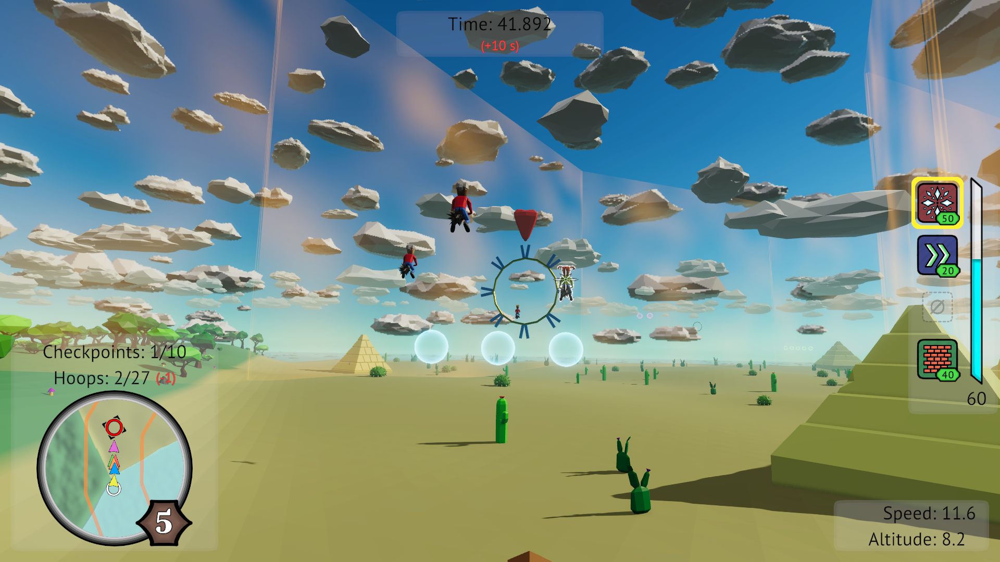

# Brooom: Race your way up!

**A broom racing game in which you fly through hoops, avoid obstacles, collect power-ups, use magic to your advantage and compete with opponents to become the number one.**

**Project start:** April 2023

**Date of completion (demo version):** April 2025 (implementation), July 2025 (master thesis text), September 2025 (thesis defense)

The thesis was successfully defended and has been nominated for the prestigious **IT SPY award** (which is still ongoing).

**Links:** [game page](https://michelle2.itch.io/brooom), [source code](https://github.com/Michelle123211/Brooom), [thesis](./brooom-master_thesis.pdf) (in Czech)

**Progress:**

- I started with writing down a game design document (GDD) which serves as a basis for the implementation.
- All major parts are already implemented, i.e.:
  - Gameplay mechanics - flying, broom upgrades, hoops, power-ups, achievements.
  - Procedural level generation.
  - 3D models - hoops, broom, player character (+ idle animations), environment elements.
  - Basic UI - main menu, setting, loading screen, character customization, HUD, player overview, shop, race results, cutscenes.
  - Utilities - localization, keys rebinding, persistent save system, tooltips, custom messaging system, cheats.
  - Opponents' artificial intelligence.
  - Spell system (including spell casting AI).
  - Music and sound effects.
  - Better UI.
  - Level optimizations.
  - Tutorial.
  - Quick race option.
  - Game icon.
  - Separate track generator scene (with an option to set different parameters).
- I also conducted a series of experiments:
  - Playtesting sessions with different players.
  - Checking the clarity of spell icons (using Form Follows Function concept).
  - Evaluating game satisfaction (using GUESS).
  - Collecting game analytics and analyzing them for game balancing.
- And I have written the master thesis itself.
- Then I created a game trailer, short gameplay video and successfully defended the thesis with a presentation.
- Now I'm creating a one-page information leaflet which can be submitted for the IT SPY award.

**Result:** You can try the [last playable version](./Brooom.zip) (from July 2025), but keep in mind it is only a demo version which is still far from being a finished and publishable game.

**Screenshots**:

