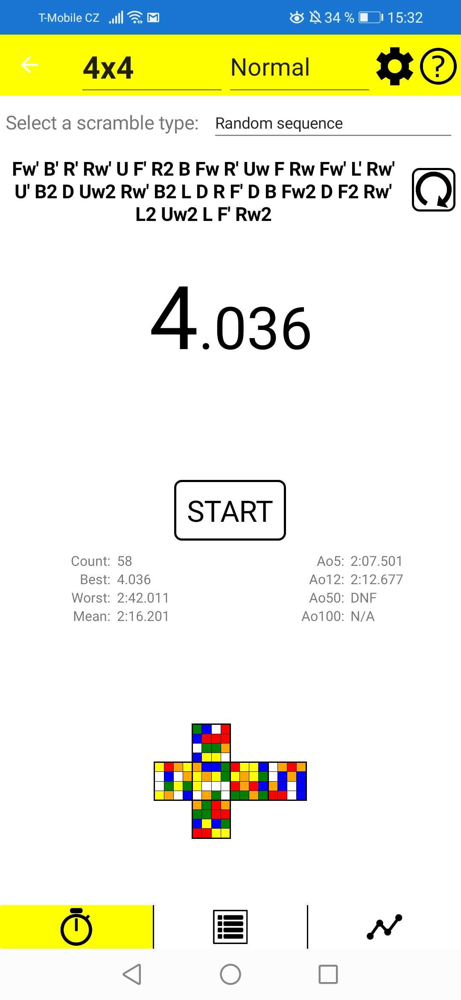
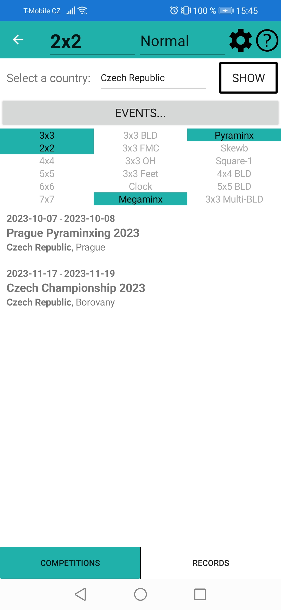

# uCube - speedcubing mobile application

**An Adroid application for speedcubing**.

*Project duration:* August 2019 - June 2020

*Description:* uCube is an application developed in Xamarin.Forms, which is cross-platform but Android was the target platform (with proof-of-concept Windows build).

- It contains:
  - timer with inspection,
  - different scramble generators (random state and random sequence), 
  - time charts tables and time charts,
  - import/export of times,
  - separate sessions for different twisty puzzle,
  - metronome,
  - an overview of personal bests for each event (single, Ao5, Ao12),
  - an API to list current WCA competitions filtered by some criteria (e.g. country, events).
- It is very easily expandable to add more functionalities (e.g. virtual cube, trainer).

*Screenshots:*

